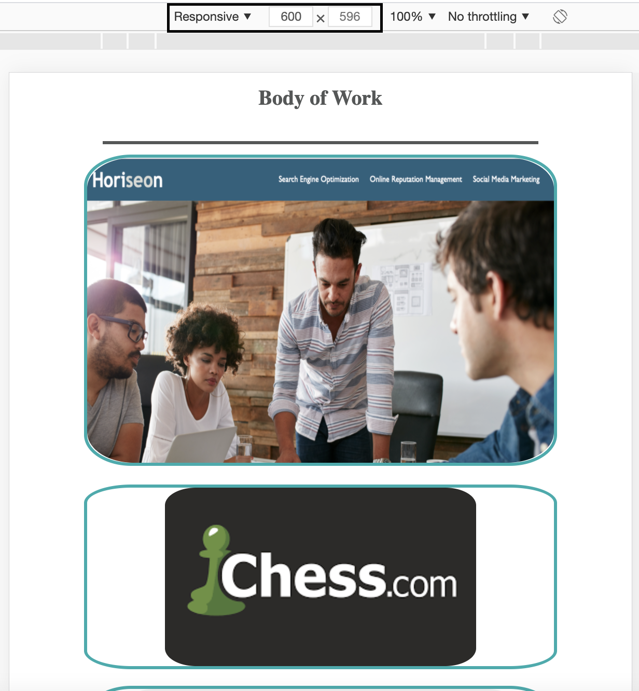
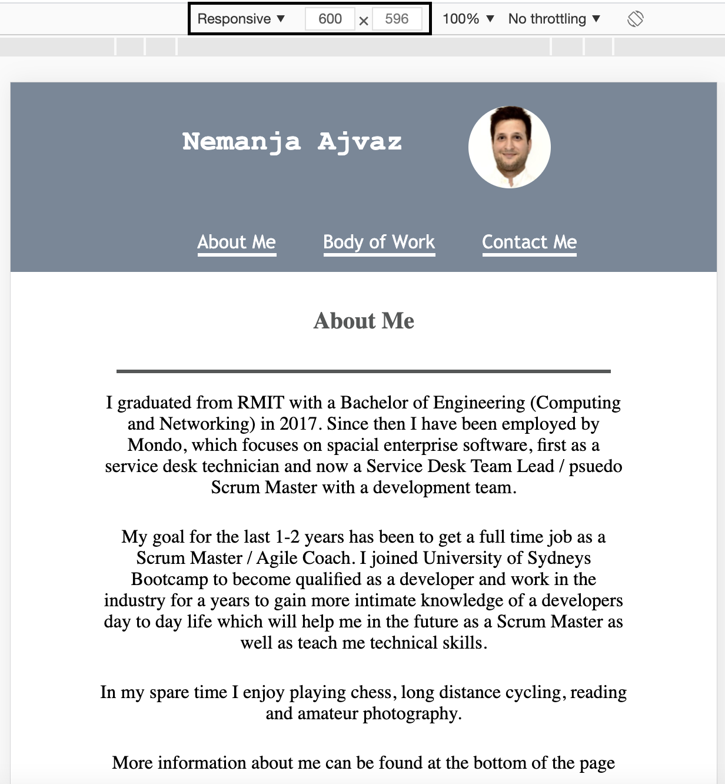
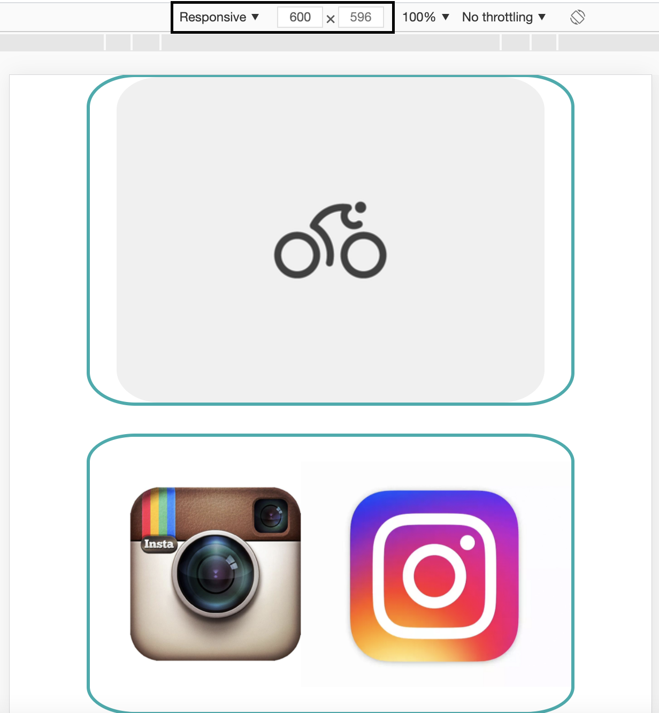
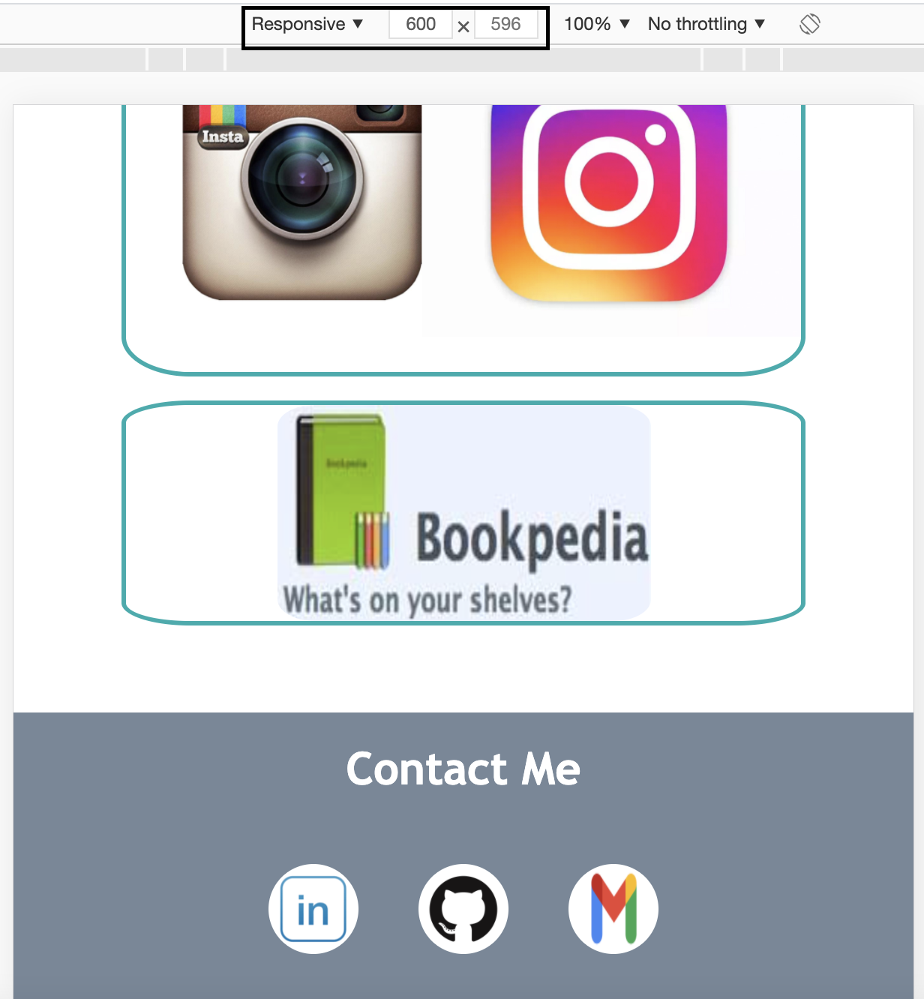

# homework_2

## Installation

To clone and run this project, please make sure you have git installed.

run `git clone https://github.com/Nem-Ajvaz/homework_2.git`

## Introduction

The purpose of this project was to build a personal portfolio for my web development journey. When visiting this page you will be able to view my LinkedIn profile, contact me via Email and ofcourse, view my completed projects on GitHub. The page has three responsive designs:

- Above 851px
- Between 850px and 601px
- Below 600px

## Images

Portfolio at a width greater than 851px

Portfolio at a width less than or equal to 850px

Portfolio at a width less than or equal to 600px

## Issues faced

The issues i encountered were to do with not having the correct viewport in the head of the file.
Not including that meant that the media queries didn't work. This proved to be very troublesome.

## Lisence

MIT
